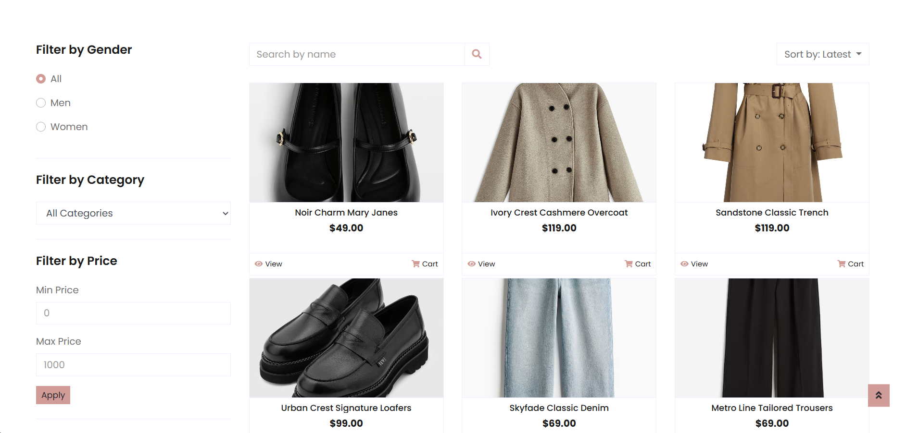
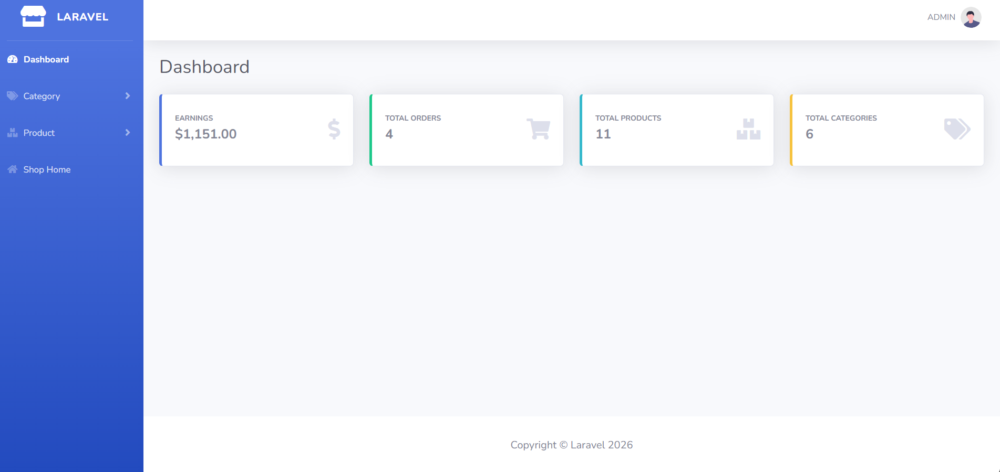

# Laravel E-Commerce Store 🛒

**A simple e-commerce web application built with Laravel** — browse products, view details, add items to cart, checkout, and manage products & categories from an admin panel.

---

## Project summary ✨
- **Title:** Laravel E‑Commerce Store
- **Repository name:** `laravel-ecommerce`
- **Stack:** PHP 8.2, Laravel 12, MySQL/SQLite, Node.js, Vite


## Features ✅
- Public product listing and product detail pages
- Cart management: add to cart, view cart, remove items
- Checkout and order confirmation
- Admin area to add / update / delete categories and products
- Authentication and user profile management
- Database migrations and seeders for easy setup


## Quick start 🔧
1. Clone the repository:
   ```bash
   git clone https://github.com/<your-username>/laravel-ecommerce.git
   cd laravel-ecommerce
   ```
2. Install PHP dependencies:
   ```bash
   composer install
   ```
3. Environment setup:
   ```bash
   cp .env.example .env
   # edit .env to set DB_CONNECTION, DB_DATABASE, DB_USERNAME, DB_PASSWORD
   php artisan key:generate
   ```
4. Run migrations (and seeders if available):
   ```bash
   php artisan migrate --seed
   ```
5. Frontend build:
   ```bash
   npm install
   npm run dev
   ```
6. Serve the app locally:
   ```bash
   php artisan serve
   ```


## Testing 🧪
Run tests with:
```bash
php artisan test
# or
./vendor/bin/pest
```

---

## Screenshots 📷
A quick visual tour of the app (images are in the `screenshots/` folder):

### Public pages
- **Homepage**

  

- **Homepage (alt)**

  

- **Homepage (alt 2)**

  

- **Shop**

  

- **Login page**

  

- **Shopping cart**

  

### Admin area
- **Admin dashboard**

  

- **Admin dashboard (alt)**

  


